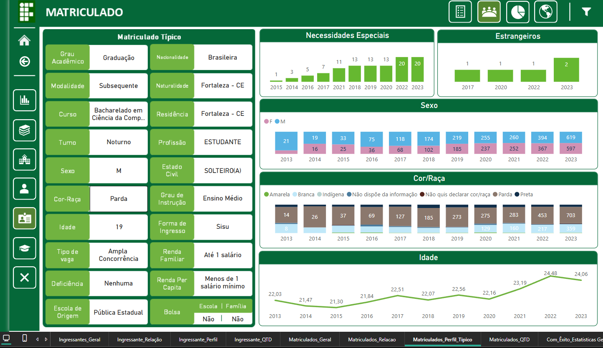
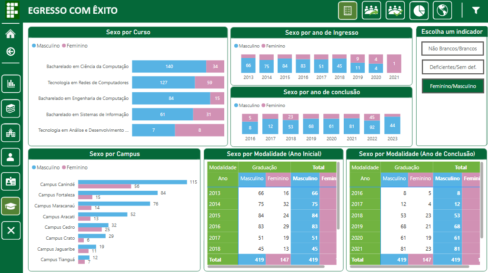

# Meus Projetos no Power BI ☺️
Boas vindas ao repositório de Dashboards que desenvolvi com Power BI. Aqui você encontrará todos os painéis que criei em pesquisas científicas ou como projetos pessoais!

## 1) Análise dos Dados Sociodemográficos dos discentes do Instituto Federal de Educação, Ciência e Tecnologia do Ceará (IFCE)
Os dados foram disponibilizados pela Pró-Reitoria de Ensino do Instituto Federal de Educação, Ciência e Tecnologia do Ceará (IFCE) no formato .xlsx, a serem utilizados estritamente para pesquisas científicas. O arquivo contém uma tabela com 133.325 linhas e 39 colunas apêndice, com os dados acadêmicos e sociodemográficos de todos os estudantes (de forma não identificada, seguindo as restrições da Lei Geral de Proteção de Dados Pessoais (LGPD)) que ingressaram no IFCE entre os anos de 2013 e 2023.

### a) Metodologia
Para o desenvolvimento da ferramenta com painéis interativos, foram utilizadas soluções da Microsoft, especificamente o Power BI, Power Query, Excel e PowerPoint. O Power BI foi a principal ferramenta para a construção dos painéis interativos, enquanto o Power Query, integrado ao Power BI, foi empregado para o tratamento e modelagem dos dados. O Excel serviu como repositório da base de dados, garantindo organização e acessibilidade, e o PowerPoint foi utilizado para o design das telas e botões.

O processo de desenvolvimento dos painéis foi estruturado em três etapas, visando uma apresentação clara e dinâmica das informações: (i) Coleta de dados, (ii) Transformação de dados e (iii) Construção dos painéis. Complementarmente, para proporcionar a qualidade e eficiência da análise de dados, foi necessária a criação de tabelas auxiliares, visando estruturar e normalizar informações essenciais ao estudo. Duas tabelas foram desenvolvidas no Power Query para dar suporte à análise e organização dos dados. Essas tabelas foram nomeadas como dCalendario e dCampus, sendo criadas com a linguagem de programação M.

Na etapa final, o painel foi disponibilizado publicamente, permitindo o acesso remoto por qualquer computador, independentemente da localização geográfica. Além disso, a visualização do painel não requer cadastro prévio em nenhuma plataforma, garantindo ampla acessibilidade e usabilidade. Para acessar o Dashboard, acesse este [Link](https://app.powerbi.com/view?r=eyJrIjoiNjNkY2MwNjMtOGNiZi00NmRjLWFlN2YtOGVlMjYxNjgyNGIxIiwidCI6IjI0YjcyZmM0LWNhZWMtNDllMi1iMGE3LTcyNjY3NTQxYWE5MyJ9&pageName=ReportSection13fa13cce0f0cc5ddaba).
